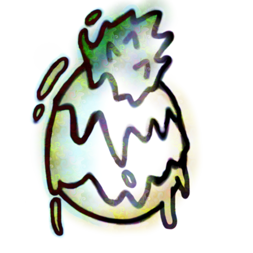

<div align="center">

# Exotic

*Exotical Deep Learning*

[](https://crates.io/crates/exotic)
[](https://github.com/unic0rn9k/exotic/actions/workflows/rust.yml)
[](https://coveralls.io/github/unic0rn9k/exotic?branch=master)
[](https://docs.rs/exotic/latest/exotic/)
[](https://www.paypal.com/paypalme/unic0rn9k/5usd)


  
</div>

Are you tired of modern deep learning frameworks making you choose between performance and being eassy to work with?
Exotic might just be what you're looking for!


Built with [unic0rn9k/slas](https://github.com/unic0rn9k/slas) (It might be a good idea to take a look at the installation section in the slas readme)

## Basic example

``` rust
use exotic::prelude::*;
use exotic_macro::*;
use mnist::*;
use slas_backend::*;

const TRN_IMAGES: usize = 60_000;

model! {(
    derive: [],
    name: "Net",
    layers: [
        ("DenseLayer::<f32, Blas, {28*28}, 20>", "DenseLayer::random(0.01)"),
        ("Tanh::<f32, 20>", "default()"),
        ("DenseLayer::<f32, Blas, 20, 10>", "DenseLayer::random(0.01)"),
        ("Softmax::<f32, 10>", "default()")
    ],
    float_type: "f32",
    input_len: 784,
    output_len: 10
)}

fn argmax(slice: &[f32]) -> usize {
    let mut max = 0;
    for n in 1..slice.len() {
        if slice[n] > slice[max] {
            max = n
        }
    }
    max
}

pub fn main() -> Result<()> {
    let Mnist {
        trn_img, trn_lbl, ..
    } = MnistBuilder::new()
        .label_format_digit()
        .training_set_length(TRN_IMAGES as u32)
        .base_path("./mnist/")
        .download_and_extract()
        .finalize();

    let trn_img = trn_img.iter().map(|n| *n as f32 / 255.).collect::<Vec<_>>();

    let mut net = Net::new();
    let mut buffer = unsafe { Net::uninit_cache() };

    let mut accuracy = [false; 400];
    let mut cost_sum = 0f32;

    for epoch in 0..400000 {
        net.l0.lr *= 0.99999;
        net.l2.lr *= 0.99999;

        let idx = epoch % TRN_IMAGES;

        let i = unsafe {
            trn_img
                .moo_ref::<{ TRN_IMAGES * 28 * 28 }>()
                .static_slice_unchecked::<{ 28 * 28 }>(idx * 28 * 28)
        };

        net.predict(i, &mut buffer)?;

        let y = onehot::<f32, 10>(trn_lbl[idx] as usize);
        let o = &buffer[buffer.len() - 10..buffer.len()];
        let dy = moo![|n| o[n] - y[n]; 10];

        let cost = o
            .iter()
            .zip(y.iter())
            .map(|(o, y)| (o - y).powi_(2))
            .sum::<f32>()
            .abs();

        if cost.is_nan() {
            panic!("cost is nan");
        }

        cost_sum += cost;

        accuracy[epoch % accuracy.len()] = argmax(o) == trn_lbl[idx] as usize;

        if epoch % 300 == 0 {
            println!(
                "\raccuracy: {:.2}% lr: {:.5} cost: {:.4?}",
                accuracy.iter().map(|n| *n as u8 as f32).sum::<f32>() / accuracy.len() as f32
                    * 100.,
                net.l0.lr,
                cost_sum / epoch as f32
            );
        }

        net.backpropagate(i, &buffer, dy)?;
    }

    Ok(())
}
```
